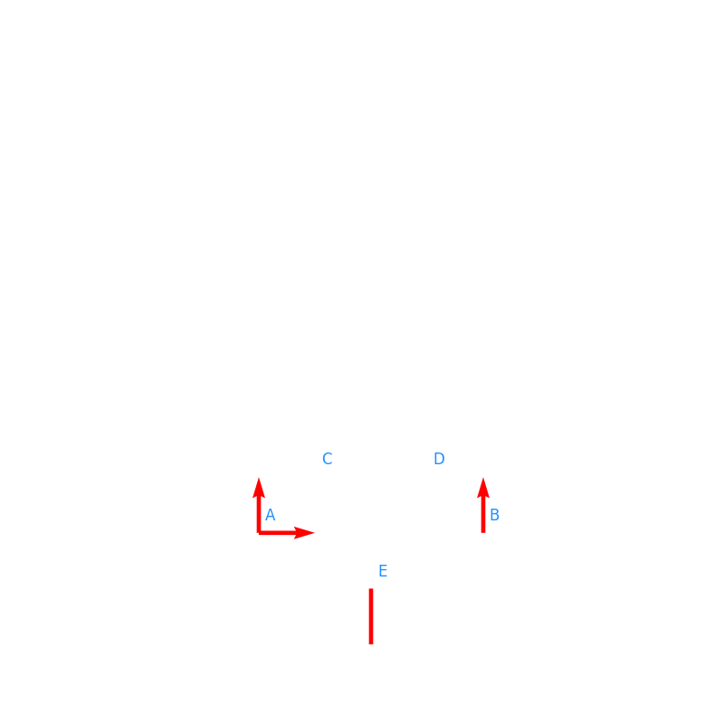

# Aufgabe 1

Aus der Geometrie des Fachwerks folgt:

$F_{AV} = F_{BV}$

$\rightarrow: 0 = F_{AH}$

$\uparrow: 0 = F_{AV} + F_{BV} + F$

$\Rightarrow F_{AV} = F_{BV} = -F/2 = 3/2 = 1.5$

Zur berechnung des Stabkräfte werden folgende Definitionen vorgenommen:

$F_{S1}$: AE

$F_{S2}$: AC

$F_{S3}$: CE

$F_{S4}$: DE
    

    

    